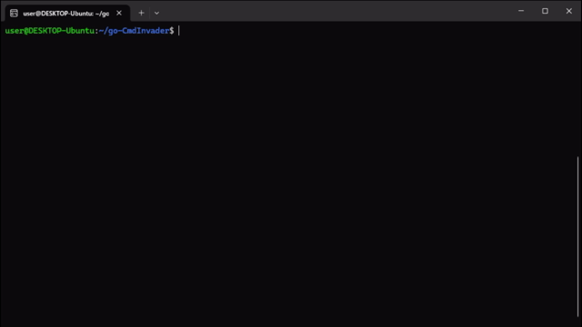

# go-CmdInvader
go-CmdInvader is a joke program that I created to learn Go and TUI.




# Usage
Super simple.
```
$ <command> | go-CmdInvader
```

Maybe this program would be able to count the number of characters excluding spaces.